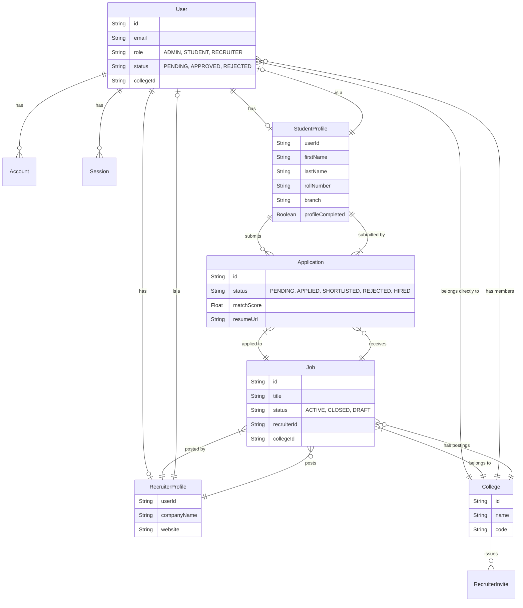
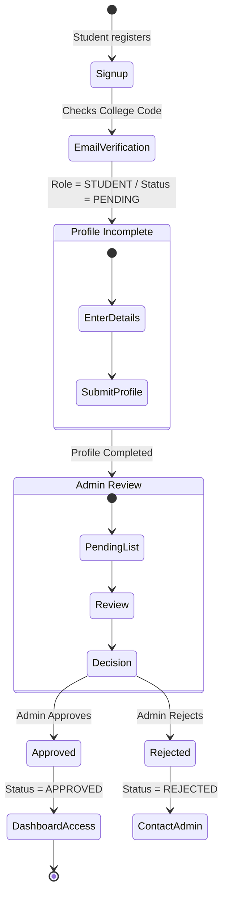
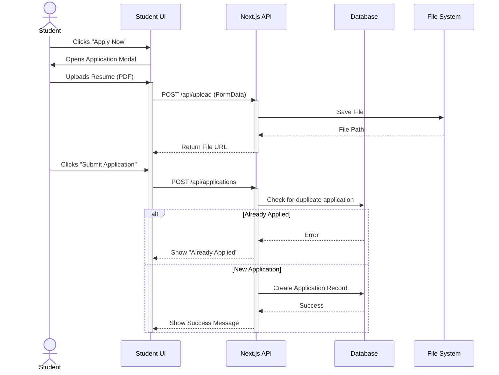
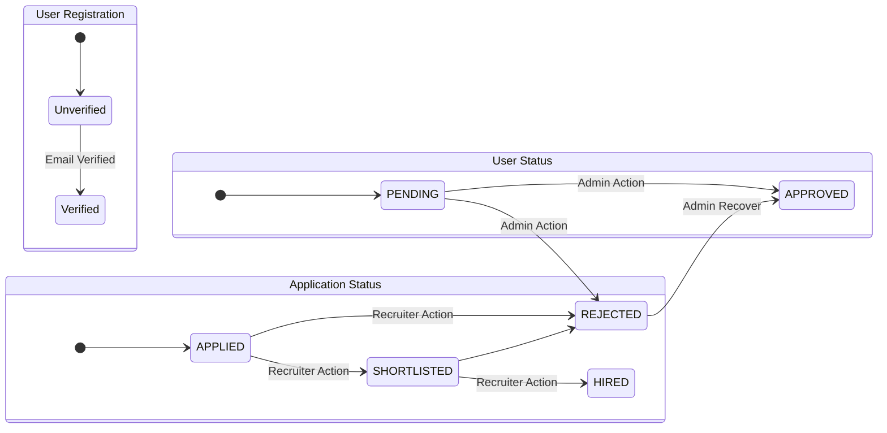

# Project Diagrams for CampusHire ATS

This document contains Mermaid diagrams illustrating the architecture, database schema, and key workflows of the CampusHire College ATS System.

## 1. Entity Relationship Diagram (ERD)

This diagram represents the database schema defined in `prisma/schema.prisma`.



## 2. System Architecture

High-level overview of the system components and their interactions.

```mermaid
graph TB
    subgraph "Frontend (Next.js)"
        Client[Web Client]
        AdminDash[Admin Dashboard]
        StudentDash[Student Dashboard]
        RecruiterDash[Recruiter Dashboard]
    end

    subgraph "Backend (Next.js API Routes)"
        AuthAPI[Auth API / NextAuth]
        JobAPI[Jobs API]
        AppAPI[Applications API]
        AdminAPI[Admin Management API]
        UploadAPI[File Upload API]
    end

    subgraph "Database & Storage"
        DB[(PostgreSQL)]
        LocalStorage[Local File Storage]
    end

    subgraph "External Services"
        Email[Nodemailer / Gmail SMTP]
        ATSEngine[Python ATS Service (Future)]
    end

    Client --> AdminDash
    Client --> StudentDash
    Client --> RecruiterDash

    AdminDash --> AuthAPI
    AdminDash --> AdminAPI
    
    StudentDash --> AuthAPI
    StudentDash --> JobAPI
    StudentDash --> AppAPI
    StudentDash --> UploadAPI
    
    RecruiterDash --> AuthAPI
    RecruiterDash --> JobAPI
    RecruiterDash --> AppAPI

    AuthAPI --> DB
    JobAPI --> DB
    AppAPI --> DB
    AdminAPI --> DB
    
    UploadAPI --> LocalStorage
    
    AdminAPI --> Email
    AppAPI -.-> ATSEngine
```

## 3. Student Onboarding & Approval Flow

Visualizes the process of a student signing up, completing their profile, and getting approved by an admin.



## 4. Job Application Process (Sequence Diagram)

Detailed sequence of events when a student applies for a job.



## 5. Recruiter Job Management Lifecycle

Flowchart showing the recruiter's capabilities regarding job postings.

```mermaid
flowchart TD
    Start((Recruiter Log In)) --> Dashboard[Recruiter Dashboard]
    Dashboard --> Actions{Choose Action}
    
    Actions -->|Post Job| CreateForm[Job Creation Form]
    CreateForm --> Validate{Validate Inputs}
    Validate -- Invalid --> CreateForm
    Validate -- Valid --> SaveJob[Save to DB (Status: ACTIVE)]
    SaveJob --> ViewJobs[My Jobs List]
    
    Actions -->|View Jobs| ViewJobs
    ViewJobs --> SelectJob[Select Job]
    SelectJob --> JobDetails[Job Details Page]
    
    JobDetails --> ViewApplicants[View Applicants]
    ViewApplicants --> Screen{Screen Candidate}
    
    Screen -->|Shortlist| StatusShort[Mark as SHORTLISTED]
    Screen -->|Reject| StatusReject[Mark as REJECTED]
    Screen -->|Hire| StatusHire[Mark as HIRED]
    
    StatusShort --> UpdateDB[(Update Application Status)]
    StatusReject --> UpdateDB
    StatusHire --> UpdateDB
```

## 6. Admin Management & System States

State diagram for the different user roles and their transitions managed by the Admin.

